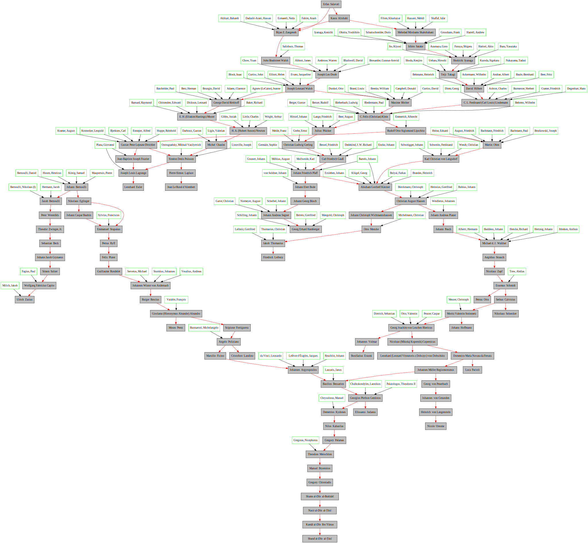

# Usage
To install the dependencies, run the following command:
```
$ pip install -r requirements.txt
```

Run `console.py` to start the code, and then enter the name of the person you want to search for.

Program will print advisors of the person and their advisors and so on.
The main output will be saved in the `output.dot` file. use `dot` command or any other graphviz tool to visualize the graph.

You can also use [This](http://magjac.com/graphviz-visual-editor/) to visualize the graph.

# Output Example

